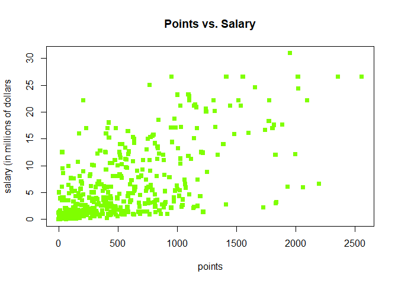
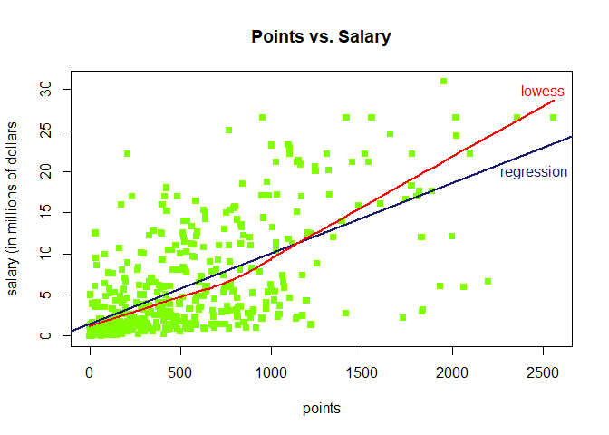
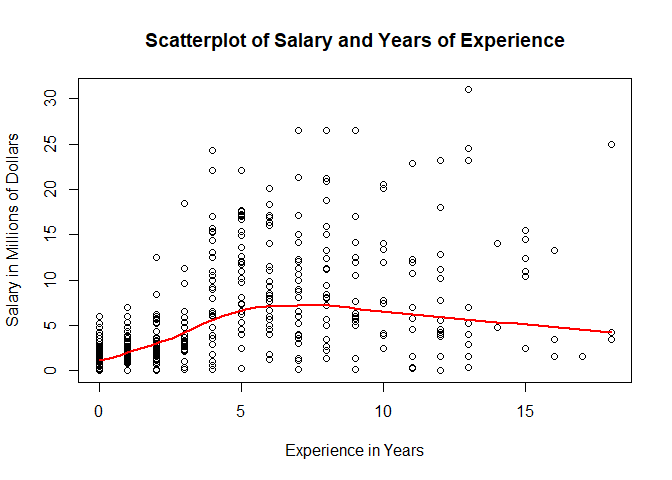
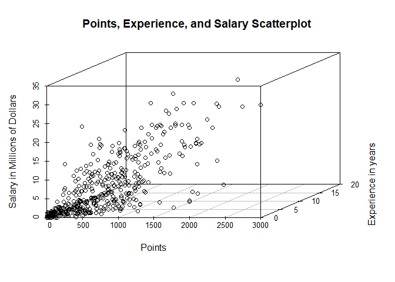
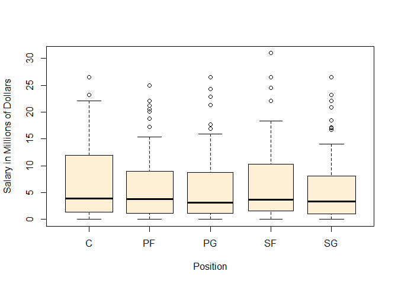

hw01-lindsay-dahlen.Rmd
================
Lindsay Dahlen
September 20, 2017

HW 01
=====

``` r
load("data/nba2017-salary-points.RData")
ls()
```

    ## [1] "experience" "player"     "points"     "points1"    "points2"   
    ## [6] "points3"    "position"   "salary"     "team"

1)
--

``` r
salarymil <- salary/1000000
salarymiltwo <- round(salarymil, digits = 2)
salarymiltwo
```

    ##   [1] 26.54 12.00  8.27  1.45  1.41  6.59  6.29  1.83  4.74  5.00  1.22
    ##  [12]  3.09  3.58  1.91  8.00  7.81  0.02  0.26  0.27  0.01  9.70 12.80
    ##  [23]  1.55  0.54 21.17  5.24 17.64 30.96  2.50 15.33  1.59  7.33  1.58
    ##  [34] 26.54 14.20  0.54  2.70 14.38 12.00  1.92  0.87  5.30  1.20  6.05
    ##  [45] 12.25  3.73 22.12  1.20  1.19  0.54 15.94  5.00 16.96 12.00  7.40
    ##  [56]  5.89  0.54  2.87  3.39  1.50  2.71 23.18  8.40  0.39 15.73  4.00
    ##  [67]  2.50  4.84  1.02 20.07  0.42  3.85  2.28  3.00 17.10  5.37  1.55
    ##  [78] 12.52 15.20  0.92  9.61  1.40 10.50  1.81  6.35  2.57  2.37  2.70
    ##  [89] 10.23  4.58  0.65  8.80  1.05  1.80  4.00  4.00 10.77  2.46 18.31
    ## [100]  1.05 14.15  3.49  1.45  2.11  0.87  2.09 23.20  1.02  1.64 17.55
    ## [111]  1.71  3.18  5.78  0.75 14.00 13.22  2.90 15.89 22.12  4.00  5.78
    ## [122]  0.87  2.59  1.23  0.21  0.54  5.63  4.00  6.00  1.02 22.12  6.50
    ## [133]  1.55  7.00  0.87  1.70  6.00 10.99  3.68  4.62  0.65  2.26 14.96
    ## [144]  2.97 17.20  1.05  0.10  0.87  5.32  2.73  6.51  0.16 12.00  6.33
    ## [155] 12.25 13.00 12.50 20.87  6.00  0.54 24.56  0.14 11.24 21.32 17.00
    ## [166]  1.02  4.32  3.90  6.19  0.54  0.54  2.90  0.54  1.41  1.38  4.35
    ## [177] 17.00  5.00  7.25  0.98  2.61 17.00 15.00  6.54  0.03  3.91 11.75
    ## [188]  0.03  0.95 10.00  0.03  2.32  9.00  4.79  9.42  4.83  1.51  2.99
    ## [199]  1.03  1.02  8.00  0.09  0.87  8.55  1.33  6.09  0.12 21.17  1.56
    ## [210]  1.07 11.48  0.98  3.00  3.33  1.79  2.50  1.40  0.98  0.73  9.25
    ## [221] 11.13  1.17  1.55 15.33  1.02  0.98  1.40 26.54  1.18 16.66  0.38
    ## [232]  0.54  5.78 12.11  2.90  0.54 10.00  1.55  0.54  1.18  2.90  0.17
    ## [243]  0.87 17.64  1.19 20.58 14.00  3.58 15.50 14.45  0.68  0.54  1.30
    ## [254] 12.39  0.26 26.54  0.54  7.00  1.00  6.00 18.74  1.72  7.81  0.15
    ## [265]  1.32 11.00 20.14  1.55  1.27 22.87 21.17  0.54  7.38 13.25  2.20
    ## [276]  1.40  3.50  1.55  5.63 10.15  7.00  3.94 11.05  8.00 16.07  1.02
    ## [287]  2.25 11.00  0.60  0.94  1.41  2.12  2.43  2.34  5.99  2.18  2.44
    ## [298]  2.48 17.15  0.98  1.19  4.84  3.75  0.25 26.54  0.54  3.14  8.95
    ## [309]  6.55  0.94  5.70 22.12  1.37  2.90  0.98  1.29 21.17 26.54  5.51
    ## [320]  3.33  4.26  1.79  0.08 10.36  7.68 18.50  3.22 24.33  6.67 16.39
    ## [331]  0.60  1.92  8.99  9.21  2.75  0.87  1.35  0.54 15.05  8.07  3.24
    ## [342]  1.66  3.21  4.54  1.99 12.08  1.63  2.33  3.50  1.36  5.00  3.53
    ## [353] 11.20  4.60 22.12  0.02  0.54  2.98 16.96  0.58  8.08  0.17 11.29
    ## [364]  9.90  0.06 11.24  2.09  0.65  1.02  4.23 25.00  0.54  8.38 22.12
    ## [375]  4.10  0.06  4.38  0.54  0.87  2.90 17.10  0.21  8.00 12.50  4.01
    ## [386]  3.52  5.23  8.00  2.20  8.05  5.20  1.44 13.33  1.19  1.32 10.66
    ## [397]  3.55  2.02  6.01  3.50  7.64  2.35  3.91  5.96  3.87  3.80  0.14
    ## [408] 13.55  3.05  1.34  2.24  5.28  7.60  5.33  0.07  1.03 12.50  3.27
    ## [419]  1.21 18.00  1.55  5.44  6.19  1.05 16.00  1.73  0.87  4.82 12.61
    ## [430]  0.54  2.22  4.28  0.02 14.00 10.47  4.00  2.94  0.28  2.13  0.92
    ## [441] 12.41

``` r
# Experience 
experienceN <- replace(experience, experience == "R", 0)
experience_integer <- as.integer(experienceN)
class(experience_integer)
```

    ## [1] "integer"

``` r
experienceN
```

    ##   [1] "9"  "11" "6"  "0"  "9"  "5"  "4"  "2"  "0"  "6"  "1"  "3"  "2"  "1" 
    ##  [15] "4"  "10" "12" "11" "5"  "1"  "5"  "12" "13" "0"  "8"  "13" "5"  "13"
    ##  [29] "15" "5"  "2"  "5"  "1"  "7"  "7"  "0"  "0"  "4"  "10" "2"  "1"  "5" 
    ##  [43] "0"  "6"  "7"  "2"  "4"  "7"  "1"  "0"  "8"  "8"  "6"  "9"  "5"  "3" 
    ##  [57] "0"  "0"  "3"  "0"  "3"  "12" "8"  "11" "4"  "12" "0"  "14" "3"  "10"
    ##  [71] "3"  "10" "3"  "3"  "6"  "2"  "17" "4"  "4"  "0"  "3"  "8"  "4"  "1" 
    ##  [85] "9"  "0"  "3"  "8"  "12" "11" "0"  "7"  "1"  "6"  "6"  "5"  "11" "1" 
    ##  [99] "6"  "1"  "9"  "8"  "1"  "1"  "1"  "0"  "13" "3"  "1"  "5"  "2"  "3" 
    ## [113] "2"  "0"  "10" "8"  "4"  "8"  "4"  "7"  "9"  "1"  "1"  "6"  "0"  "0" 
    ## [127] "2"  "13" "7"  "1"  "4"  "4"  "12" "1"  "1"  "0"  "6"  "5"  "3"  "5" 
    ## [141] "0"  "3"  "5"  "1"  "5"  "4"  "1"  "1"  "3"  "1"  "4"  "2"  "5"  "9" 
    ## [155] "11" "4"  "4"  "8"  "9"  "0"  "13" "0"  "8"  "7"  "9"  "3"  "1"  "4" 
    ## [169] "5"  "0"  "0"  "0"  "0"  "9"  "0"  "2"  "5"  "9"  "8"  "2"  "2"  "4" 
    ## [183] "8"  "7"  "0"  "1"  "5"  "0"  "0"  "4"  "0"  "0"  "7"  "1"  "8"  "0" 
    ## [197] "1"  "2"  "1"  "3"  "4"  "0"  "1"  "6"  "0"  "4"  "3"  "8"  "0"  "0" 
    ## [211] "6"  "2"  "2"  "2"  "4"  "10" "1"  "2"  "2"  "6"  "12" "0"  "13" "4" 
    ## [225] "3"  "2"  "8"  "9"  "1"  "5"  "13" "0"  "11" "7"  "13" "0"  "7"  "11"
    ## [239] "0"  "0"  "3"  "9"  "1"  "5"  "2"  "10" "14" "7"  "15" "15" "2"  "0" 
    ## [253] "2"  "8"  "0"  "7"  "0"  "11" "1"  "4"  "8"  "1"  "12" "0"  "7"  "4" 
    ## [267] "6"  "11" "0"  "11" "8"  "0"  "10" "16" "8"  "8"  "18" "11" "6"  "5" 
    ## [281] "13" "1"  "6"  "8"  "6"  "3"  "2"  "15" "0"  "1"  "2"  "3"  "5"  "1" 
    ## [295] "0"  "3"  "0"  "2"  "5"  "2"  "1"  "4"  "12" "5"  "8"  "0"  "3"  "7" 
    ## [309] "3"  "0"  "8"  "5"  "0"  "2"  "2"  "1"  "8"  "9"  "12" "3"  "18" "0" 
    ## [323] "0"  "15" "6"  "3"  "3"  "4"  "6"  "6"  "0"  "2"  "4"  "4"  "2"  "1" 
    ## [337] "2"  "0"  "7"  "7"  "1"  "2"  "0"  "12" "0"  "5"  "0"  "3"  "16" "1" 
    ## [351] "8"  "4"  "8"  "6"  "4"  "1"  "0"  "7"  "6"  "4"  "5"  "4"  "7"  "6" 
    ## [365] "0"  "3"  "2"  "0"  "3"  "12" "18" "0"  "2"  "4"  "10" "0"  "2"  "0" 
    ## [379] "1"  "3"  "7"  "0"  "8"  "9"  "3"  "0"  "7"  "6"  "0"  "8"  "2"  "0" 
    ## [393] "10" "0"  "7"  "7"  "1"  "2"  "2"  "8"  "6"  "3"  "7"  "1"  "0"  "1" 
    ## [407] "7"  "5"  "3"  "1"  "2"  "0"  "9"  "1"  "0"  "0"  "2"  "2"  "1"  "12"
    ## [421] "16" "9"  "2"  "4"  "6"  "2"  "1"  "3"  "5"  "0"  "1"  "0"  "2"  "6" 
    ## [435] "9"  "13" "0"  "11" "2"  "0"  "15"

``` r
# Position
fposition <- factor(position)
fposition
```

    ##   [1] C  PF SG PG SF PG SF SG SF PF PF C  SG PG C  C  SF PG PF C  SG SG SF
    ##  [24] PG PF SG PG SF SF C  SF SG PG SG SF PG C  C  PG C  SG SF PF PF PF SF
    ##  [47] SG PG PF C  C  C  PG C  PF SF SG SG PG SF PG C  PF PG SF PF PG SF C 
    ##  [70] PF PF SF SG SF C  PF SG C  SF SG PG PF PF SG PF C  SG PG C  SF PF PG
    ##  [93] PG PF SG PF SG C  SF PF PF SG PF PG C  SG SG SG PG SF C  PG PF SF PG
    ## [116] C  SG PG C  PF PF SG SF SF PF SG PG C  SG C  C  C  PG C  SG PF PG PF
    ## [139] SG SF SG SF PG SF PF PG PG PF PF C  SG PF PG SG PF SF C  SG PG SG SF
    ## [162] PG SG PG C  SG PF C  PF C  PF SF SG SG C  SF C  PG PG SF PG SG PF SG
    ## [185] SG SF C  SG C  SF PF PF SG C  PG C  SF SG C  SF PG C  PG C  SF PF SG
    ## [208] C  SF PG PG SG C  SF PF SG SF SG PG PF SF C  C  PF SG PF C  SF C  SG
    ## [231] SF SG PG PG C  SG SG PF PF PG C  C  SG SF SG PF SG PG C  PG PG C  C 
    ## [254] SG PG PG PF SG C  SG PF SF SF SF SF SG PF PF PF PG C  C  SG SG SF C 
    ## [277] SF PG SF SG PF PG PF PG SF C  SF SF PF PG SG C  PG PF SG SF PF SF C 
    ## [300] SF PF SF PF PG PG PG C  PF SG PG PF SF C  SF PF PF C  PG SG SG SF PG
    ## [323] SG PF SF SG SG PG PF SF SF C  SF PF PF SG PG SG SF PF PG SG SG PG PF
    ## [346] PF SG C  SF C  C  SG SF C  C  SF PF SF C  PF SG SG PG C  PG SF PG C 
    ## [369] SG PG PF PF C  PF PG PF C  SF C  PG SG PG PF SG SG SG PG SG C  C  PG
    ## [392] SG SF PF PG SF C  PF SF SG C  PF C  C  PG PF SF PG SF PG SG SF SF PG
    ## [415] SG C  SG PF PF SF SF SG C  PF C  PG C  C  SG SF SG PF SG PG PF SG PF
    ## [438] PG SF PG C 
    ## Levels: C PF PG SF SG

``` r
levels(fposition) <- c('center', 'power_fwd', 'point_guard', 'small_fwd', 'shoot_guard')
fposition
```

    ##   [1] center      power_fwd   shoot_guard point_guard small_fwd  
    ##   [6] point_guard small_fwd   shoot_guard small_fwd   power_fwd  
    ##  [11] power_fwd   center      shoot_guard point_guard center     
    ##  [16] center      small_fwd   point_guard power_fwd   center     
    ##  [21] shoot_guard shoot_guard small_fwd   point_guard power_fwd  
    ##  [26] shoot_guard point_guard small_fwd   small_fwd   center     
    ##  [31] small_fwd   shoot_guard point_guard shoot_guard small_fwd  
    ##  [36] point_guard center      center      point_guard center     
    ##  [41] shoot_guard small_fwd   power_fwd   power_fwd   power_fwd  
    ##  [46] small_fwd   shoot_guard point_guard power_fwd   center     
    ##  [51] center      center      point_guard center      power_fwd  
    ##  [56] small_fwd   shoot_guard shoot_guard point_guard small_fwd  
    ##  [61] point_guard center      power_fwd   point_guard small_fwd  
    ##  [66] power_fwd   point_guard small_fwd   center      power_fwd  
    ##  [71] power_fwd   small_fwd   shoot_guard small_fwd   center     
    ##  [76] power_fwd   shoot_guard center      small_fwd   shoot_guard
    ##  [81] point_guard power_fwd   power_fwd   shoot_guard power_fwd  
    ##  [86] center      shoot_guard point_guard center      small_fwd  
    ##  [91] power_fwd   point_guard point_guard power_fwd   shoot_guard
    ##  [96] power_fwd   shoot_guard center      small_fwd   power_fwd  
    ## [101] power_fwd   shoot_guard power_fwd   point_guard center     
    ## [106] shoot_guard shoot_guard shoot_guard point_guard small_fwd  
    ## [111] center      point_guard power_fwd   small_fwd   point_guard
    ## [116] center      shoot_guard point_guard center      power_fwd  
    ## [121] power_fwd   shoot_guard small_fwd   small_fwd   power_fwd  
    ## [126] shoot_guard point_guard center      shoot_guard center     
    ## [131] center      center      point_guard center      shoot_guard
    ## [136] power_fwd   point_guard power_fwd   shoot_guard small_fwd  
    ## [141] shoot_guard small_fwd   point_guard small_fwd   power_fwd  
    ## [146] point_guard point_guard power_fwd   power_fwd   center     
    ## [151] shoot_guard power_fwd   point_guard shoot_guard power_fwd  
    ## [156] small_fwd   center      shoot_guard point_guard shoot_guard
    ## [161] small_fwd   point_guard shoot_guard point_guard center     
    ## [166] shoot_guard power_fwd   center      power_fwd   center     
    ## [171] power_fwd   small_fwd   shoot_guard shoot_guard center     
    ## [176] small_fwd   center      point_guard point_guard small_fwd  
    ## [181] point_guard shoot_guard power_fwd   shoot_guard shoot_guard
    ## [186] small_fwd   center      shoot_guard center      small_fwd  
    ## [191] power_fwd   power_fwd   shoot_guard center      point_guard
    ## [196] center      small_fwd   shoot_guard center      small_fwd  
    ## [201] point_guard center      point_guard center      small_fwd  
    ## [206] power_fwd   shoot_guard center      small_fwd   point_guard
    ## [211] point_guard shoot_guard center      small_fwd   power_fwd  
    ## [216] shoot_guard small_fwd   shoot_guard point_guard power_fwd  
    ## [221] small_fwd   center      center      power_fwd   shoot_guard
    ## [226] power_fwd   center      small_fwd   center      shoot_guard
    ## [231] small_fwd   shoot_guard point_guard point_guard center     
    ## [236] shoot_guard shoot_guard power_fwd   power_fwd   point_guard
    ## [241] center      center      shoot_guard small_fwd   shoot_guard
    ## [246] power_fwd   shoot_guard point_guard center      point_guard
    ## [251] point_guard center      center      shoot_guard point_guard
    ## [256] point_guard power_fwd   shoot_guard center      shoot_guard
    ## [261] power_fwd   small_fwd   small_fwd   small_fwd   small_fwd  
    ## [266] shoot_guard power_fwd   power_fwd   power_fwd   point_guard
    ## [271] center      center      shoot_guard shoot_guard small_fwd  
    ## [276] center      small_fwd   point_guard small_fwd   shoot_guard
    ## [281] power_fwd   point_guard power_fwd   point_guard small_fwd  
    ## [286] center      small_fwd   small_fwd   power_fwd   point_guard
    ## [291] shoot_guard center      point_guard power_fwd   shoot_guard
    ## [296] small_fwd   power_fwd   small_fwd   center      small_fwd  
    ## [301] power_fwd   small_fwd   power_fwd   point_guard point_guard
    ## [306] point_guard center      power_fwd   shoot_guard point_guard
    ## [311] power_fwd   small_fwd   center      small_fwd   power_fwd  
    ## [316] power_fwd   center      point_guard shoot_guard shoot_guard
    ## [321] small_fwd   point_guard shoot_guard power_fwd   small_fwd  
    ## [326] shoot_guard shoot_guard point_guard power_fwd   small_fwd  
    ## [331] small_fwd   center      small_fwd   power_fwd   power_fwd  
    ## [336] shoot_guard point_guard shoot_guard small_fwd   power_fwd  
    ## [341] point_guard shoot_guard shoot_guard point_guard power_fwd  
    ## [346] power_fwd   shoot_guard center      small_fwd   center     
    ## [351] center      shoot_guard small_fwd   center      center     
    ## [356] small_fwd   power_fwd   small_fwd   center      power_fwd  
    ## [361] shoot_guard shoot_guard point_guard center      point_guard
    ## [366] small_fwd   point_guard center      shoot_guard point_guard
    ## [371] power_fwd   power_fwd   center      power_fwd   point_guard
    ## [376] power_fwd   center      small_fwd   center      point_guard
    ## [381] shoot_guard point_guard power_fwd   shoot_guard shoot_guard
    ## [386] shoot_guard point_guard shoot_guard center      center     
    ## [391] point_guard shoot_guard small_fwd   power_fwd   point_guard
    ## [396] small_fwd   center      power_fwd   small_fwd   shoot_guard
    ## [401] center      power_fwd   center      center      point_guard
    ## [406] power_fwd   small_fwd   point_guard small_fwd   point_guard
    ## [411] shoot_guard small_fwd   small_fwd   point_guard shoot_guard
    ## [416] center      shoot_guard power_fwd   power_fwd   small_fwd  
    ## [421] small_fwd   shoot_guard center      power_fwd   center     
    ## [426] point_guard center      center      shoot_guard small_fwd  
    ## [431] shoot_guard power_fwd   shoot_guard point_guard power_fwd  
    ## [436] shoot_guard power_fwd   point_guard small_fwd   point_guard
    ## [441] center     
    ## Levels: center power_fwd point_guard small_fwd shoot_guard

``` r
# Calculate frequencies
table(fposition)
```

    ## fposition
    ##      center   power_fwd point_guard   small_fwd shoot_guard 
    ##          89          89          85          83          95

2)
--

``` r
# Plot
plot(points, salary/1000000, pch = 15, col = "chartreuse", cex = 1, xlab = "points", ylab = "salary (in millions of dollars", main = "Points vs. Salary")
```

 \#\#\# This scatterplot indicates that more points scored correlates with a higher salary, although there are exceptions to this. For example, some players that score many points have similar salaries to players that score fewer points, and vice versa.

\#\# 3)

``` r
# Finding correlation
n <- 441      # There are 441 players
n
```

    ## [1] 441

``` r
# Mean
mean_points <- sum(points)/441
mean_points
```

    ## [1] 546.6054

``` r
mean_salarymiltwo <- sum(salarymiltwo)/441
mean_salarymiltwo
```

    ## [1] 6.186689

``` r
# var(X)
var_points1 <- (points - mean_points)
var_points2 <- sum(var_points1^2)
var_points <- (1/440)*var_points2
var_points
```

    ## [1] 239136.2

``` r
# var(Y)
var_salarymiltwo1 <- (salarymiltwo - mean_salarymiltwo)
var_salarymiltwo2 <- sum(var_salarymiltwo1^2)
var_salarymiltwo <- (1/440)*var_salarymiltwo2
var_salarymiltwo
```

    ## [1] 43.19524

``` r
# Standard deviation of X
sd_points <- sqrt(var_points)
sd_points
```

    ## [1] 489.0156

``` r
# Standard deviation of Y
sd_salarymiltwo <- sqrt(var_salarymiltwo)
sd_salarymiltwo
```

    ## [1] 6.572309

``` r
# Covariance between X and Y
cov_p_s_1 <- (points - mean_points)*(salarymiltwo - mean_salarymiltwo)
cov_p_s_2 <- sum(cov_p_s_1)
cov_p_s <- (1/440)*cov_p_s_2
cov_p_s
```

    ## [1] 2046.424

``` r
# Correlation
cor_points_salarymiltwo <- (cov_p_s)/(sd_points * sd_salarymiltwo)
cor_points_salarymiltwo
```

    ## [1] 0.6367296

``` r
cor(points, salarymiltwo, use = "everything", method = c("pearson", "kendall", "spearman")) # Used cor() to confirm correlation I found manually.
```

    ## [1] 0.6367296

 =
$$\\sum\_{i=1}^{n} X\_i$$

4)
--

``` r
# Estimated slope of the regression line
slope1 <- cor_points_salarymiltwo * (sd_salarymiltwo/sd_points)
slope1
```

    ## [1] 0.008557567

``` r
# Estimated intercept of the regression line
intercept0 <- mean_salarymiltwo - (slope1*mean_points)
intercept0
```

    ## [1] 1.509077

``` r
# Y-hat, or predicted values of Y
y_hat <- intercept0 + (slope1*points)
y_hat
```

    ##   [1]  9.655880  5.959011  9.159542  1.594652  3.751159 20.327167 10.058086
    ##   [8]  2.090991  5.916224  4.067789  1.834264  7.311107  8.654645  5.017679
    ##  [15]  3.032324  7.293992  1.586095  3.040881  2.844057  1.560422  6.361217
    ##  [22]  4.512783  2.638675  2.929633 11.281818  4.701049 17.049618 18.230563
    ##  [29]  5.342867  6.900344  1.628883  7.841676  2.792712 18.795362  6.968804
    ##  [36]  2.424736  2.921075  9.715783 13.010447  3.674141  6.951689  2.698578
    ##  [43]  3.468759  5.317194  4.307401  4.333074 16.732988  2.202240  1.517634
    ##  [50]  1.714458  2.989536  5.103255 16.955485  9.065408 10.605770 10.708461
    ##  [57]  2.279258  2.826942  3.947983  2.373391 13.609476 10.083759  3.819620
    ##  [64]  2.031088  8.363688  3.708371  4.855085  2.955305  5.231618 12.171805
    ##  [71]  1.723016  5.308636 11.290376 17.186539  9.647323 10.280583  4.136250
    ##  [78]  4.863643  5.154600  8.072731  6.446793  6.027472  5.368539  2.724251
    ##  [85]  2.219355  3.443087  7.353895  4.264613  6.087375  8.483494  1.688786
    ##  [92] 12.240266  2.090991  3.494432  1.877052  3.023766  6.900344 11.547103
    ##  [99] 16.698758  2.013973  8.474936  1.859937  5.248733  1.971185  4.213268
    ## [106]  3.999329 10.888170  3.057996  4.675376 17.049618  2.270700  4.050674
    ## [113]  7.875907  3.562893  6.113048  8.688875  7.747543 14.199949 12.710932
    ## [120]  9.852704  2.424736  6.121605  3.186360  4.281728  2.347718  5.762187
    ## [127] 10.083759  1.774361  7.054380  4.709607 10.965188  4.632589  3.451644
    ## [134]  3.143572  2.595888  2.022531  7.995712  8.072731 10.468849 10.965188
    ## [141]  1.543307  2.715694  7.944367  4.410092 12.813623  2.724251  1.936955
    ## [148]  1.808591  6.977362  8.988390  6.669290  1.663113 17.169424  8.183979
    ## [155]  8.774451  7.867349  1.774361 11.470085  4.179038  1.996858 15.706080
    ## [162]  2.322045  8.654645 11.384509  3.494432  6.891786 11.743927  5.753630
    ## [169]  3.862408  1.851379  2.347718  5.146043  3.348954  2.570215  6.532368
    ## [176] 10.229237  5.642382  3.913753  6.780538  2.210797 10.460292 11.495757
    ## [183]  6.968804  4.307401  1.628883  4.221825 10.888170  1.509077  1.705901
    ## [190]  4.067789  2.056761 10.408946  7.174186  6.558041  1.791476  6.874671
    ## [197]  3.246263  7.978597  6.292757  8.902815  6.044587  2.775597  6.267084
    ## [204]  1.842822  5.317194  1.765804  2.322045 14.679172  5.514018  6.155836
    ## [211]  5.984684  5.171715  5.291521  2.587330  3.297608  4.564128  7.285434
    ## [218]  9.373481  5.205946  7.576392  6.421120  1.671670  4.213268  8.149749
    ## [225]  6.018914  2.767039  5.548248 14.816093  2.664348 16.416358  2.484639
    ## [232]  3.922311  4.837970 18.615653  5.154600  2.313488  5.762187  6.438235
    ## [239]  4.102019  2.621560  4.820855  1.723016  5.642382 17.665763  3.614238
    ## [246] 12.146132  5.933339  8.004270  8.286670  6.968804  2.039646  1.628883
    ## [253]  8.509166 11.923636  1.534749 21.670705  1.620325  4.444322  6.018914
    ## [260]  6.977362  9.886935  5.822090  9.518959  2.005416  2.245027  9.116754
    ## [267] 12.770835  4.007886  1.543307 10.956631 10.314813  1.594652 11.547103
    ## [274] 10.135104  5.650939  7.593507  2.202240  6.113048  3.100784  3.930868
    ## [281]  4.401534  5.034794  5.582479  8.603300 15.209741  2.758481  6.481023
    ## [288]  7.627737  1.697343  2.364833  7.910137 11.239030  5.188830  5.274406
    ## [295]  4.983449  5.976127  5.608151  2.749924 10.349043  5.111812  1.628883
    ## [302]  2.262143  1.791476  1.877052 23.399333  3.075111  9.253675  3.280493
    ## [309] 10.640001  5.146043  3.126457  3.306166  2.005416  5.180273  7.405240
    ## [316]  2.921075 13.883319 13.618034  7.011592  6.224296  6.523811  2.416179
    ## [323]  1.979743 10.306256  6.061702  8.740221 17.229327 18.829592  3.220590
    ## [330]  6.523811  2.176567  4.110577  8.124076  4.940661  4.307401  2.347718
    ## [337]  3.374626  1.774361 11.307491  3.751159  6.669290  8.791566  8.449263
    ## [344]  7.388125  4.119135  6.532368  2.219355  3.605681  1.748689 11.957866
    ## [351]  1.543307  8.526282 11.067879  3.280493 19.471410  1.603210  2.253585
    ## [358]  5.231618  5.051909  2.792712  7.499374  3.793947 10.314813  2.236470
    ## [365]  1.954070  6.326987  5.479788  1.919840  1.577537  5.248733  8.089846
    ## [372]  4.504225  5.924781 14.499463  4.769510  1.851379  3.117899  2.792712
    ## [379]  3.331838  9.193772  9.946838  5.000564  5.454115  5.916224  5.745072
    ## [386]  4.743837  9.210887  5.839206  2.570215  5.531133  2.484639  2.185124
    ## [393]  6.318429  3.982213  7.336780  2.903960  6.737750  2.048203 18.050854
    ## [400]  3.194917  2.407621  8.492051  1.611767 19.146222  4.016444  4.957776
    ## [407]  1.894167  8.663203  8.115518  3.297608  9.116754  7.841676  2.613003
    ## [414]  9.929723  2.535985  3.939426 11.820945  9.852704  5.351424  5.146043
    ## [421]  1.996858  8.278112  4.786625  3.571450  4.940661  2.963863  4.469995
    ## [428]  6.754865  6.600829  2.946748 16.279437  2.758481  1.534749 13.404095
    ## [435]  5.223061  5.094697  7.952925  1.628883  9.647323  5.308636  4.906431

``` r
summary(y_hat)
```

    ##    Min. 1st Qu.  Median    Mean 3rd Qu.    Max. 
    ##   1.509   2.844   5.206   6.187   8.184  23.399

``` r
x_hat <- intercept0 + (slope1*salarymiltwo)
summary(x_hat)
```

    ##    Min. 1st Qu.  Median    Mean 3rd Qu.    Max. 
    ##   1.509   1.520   1.539   1.562   1.588   1.774

-   The regression equation is $ yhat = b\_{0}+b\_{1}X$
-   The slope coefficient *b*<sub>1</sub> represents how many points a player needs to score in order to increase their salary.
-   The intercept term *b*<sub>0</sub> represents the minimum points a player can score in order to receive a salary.
-   The predicted salary of a player that scores: -- 0 points is $1.509077 million. -- 100 points is $2.3657567 million. -- 500 points is $5.7887835 million. -- 1000 points is $10.067567 million. -- 2000 points is $18.625134 million. ----------------------------------------- \#\# 5)

``` r
plot(points, salary/1000000, pch = 15, col = "chartreuse", cex = 1, xlab = "points", ylab = "salary (in millions of dollars", main = "Points vs. Salary")
abline(a = intercept0, b = slope1, col = "midnightblue", lwd = 2)
lines(lowess(points, salarymiltwo), col = "red", lwd = 2)
text(2500, 30, "lowess", col = "red", cex = 1)
text(2450, 20, "regression", col = "midnightblue", cex = 1)
```



<table style="width:58%;">
<colgroup>
<col width="58%" />
</colgroup>
<tbody>
<tr class="odd">
<td align="left">## 6)</td>
</tr>
<tr class="even">
<td align="left"><code>r # Regression Residuals # Residaul of Points residuals_points &lt;- points - y_hat summary(residuals_points)</code></td>
</tr>
<tr class="odd">
<td align="left"><code>##     Min.  1st Qu.   Median     Mean  3rd Qu.     Max. ##   -1.509  153.156  426.794  540.419  771.816 2534.601</code></td>
</tr>
<tr class="even">
<td align="left"><code>r # Residual of Salary residuals_salary &lt;- salarymiltwo - x_hat summary(residuals_salary)</code></td>
</tr>
<tr class="odd">
<td align="left"><code>##    Min. 1st Qu.  Median    Mean 3rd Qu.    Max. ## -1.4992 -0.2301  1.9610  4.6247  7.6618 29.1860</code></td>
</tr>
<tr class="even">
<td align="left"><code>r # Residual Sum of Squares for Points RSS_points &lt;-sum(residuals_points^2) RSS_points</code></td>
</tr>
<tr class="odd">
<td align="left"><code>## [1] 232221920</code></td>
</tr>
<tr class="even">
<td align="left"><code>r # Residual Sum of Squares for Salary in millions RSS_salarymiltwo &lt;- sum(residuals_salary^2) RSS_salarymiltwo</code></td>
</tr>
<tr class="odd">
<td align="left"><code>## [1] 28113.93</code></td>
</tr>
<tr class="even">
<td align="left"><code>r # Total Sum of Squares TSS_salary &lt;- sum((salarymiltwo - mean_salarymiltwo)^2) TSS_points &lt;- sum((points - mean_points)^2) TSS_salary</code></td>
</tr>
<tr class="odd">
<td align="left"><code>## [1] 19005.91</code></td>
</tr>
<tr class="even">
<td align="left"><code>r TSS_points</code></td>
</tr>
<tr class="odd">
<td align="left"><code>## [1] 105219947</code></td>
</tr>
<tr class="even">
<td align="left"><code>r # The coefficient of determination for Points R2_points &lt;- 1-(RSS_points/TSS_points) R2_points</code></td>
</tr>
<tr class="odd">
<td align="left"><code>## [1] -1.207014</code></td>
</tr>
<tr class="even">
<td align="left"><code>r # The coefficient of determination for Salary in millionis R2_salary &lt;- 1-(RSS_salarymiltwo/TSS_salary) R2_salary</code></td>
</tr>
<tr class="odd">
<td align="left"><code>## [1] -0.4792206</code></td>
</tr>
</tbody>
</table>

7)
--

``` r
# Scatterplot of Years of Experience and Salary
plot(experience_integer, salarymiltwo, type = "p", main = "Scatterplot of Salary and Years of Experience", xlab = "Experience in Years", ylab = "Salary in Millions of Dollars", ann = par("ann"), cex = 1, pch = 21)
lines(loess.smooth(experience_integer, salarymiltwo, span = 2/3, degree = 1,
    family = c("symmetric", "gaussian"), evaluation = 50), col = "red", lwd = 2)
```



``` r
# Scatterplot of Points, Experience, and Salary
library(scatterplot3d)
scatterplot3d(points, experience_integer, salarymiltwo, color = par("col"), pch = 1, main = "Points, Experience, and Salary Scatterplot", xlab = "Points", ylab = "Experience in years", zlab = "Salary in Millions of Dollars", scale.y = 1, col.grid = "grey")
```



``` r
# Conditional boxplot of Salary in terms of Position
boxplot(salarymiltwo ~ position, range = 1, varwidth = TRUE, outline = TRUE, col = "papayawhip", xlab = "Position", ylab = "Salary in Millions of Dollars")
```

 - The first plot seems to indicate that years of experience does not have anything to do with the salary. The second plot shows that in general, more years of experience does not equate to a higher salary, but that more points scored does. The last plot shows that in general, all positions are paid around the same salary. - Based on the scatterplots, experience seems to be somewhat related with salary, though salary is more related to points than experience. - Based on the boxplot, position does not seem to be related with salary.

------------------------------------------------------------------------

8)
--

-   Things that were hard were formating the in-text code, looking up functions I didn't know, and formating the plots.
-   One thing that was easy-ish was creating new chunks without having to press the 'insert' button.
-   This class is my first exposure to Git. I don't think I like it, mainly because I'm unsure about what I'm doing.
-   I did need help to complete this assignment. I got assistance from my friend Hannah S. who is also taking the class, and my friend Sruthi.
-   This homework took me over 8 hours to complete, spread over 3 days.
-   The most time consuming part was trying to look up functions, especially for graphing data, and trying to make it work. It was also tedious to write out each equation in parts.
-   I still do not understand how to write in-line equations.
-   The most frustrating thing about this homework was how helpless I felt. I dislike having to look up everything myself, especially since I'm not sure if I'm doing it correctly.
-   I'm very proud of my plots, especially with changing the colors/labels/shapes/etc. \`\`\`
