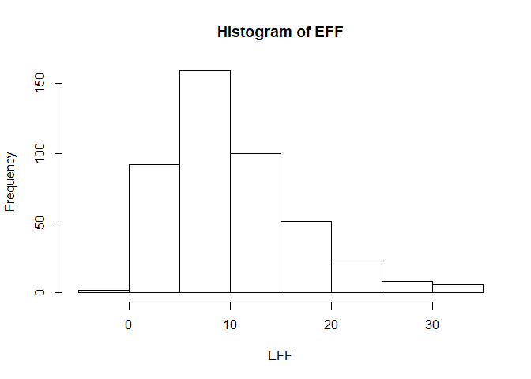
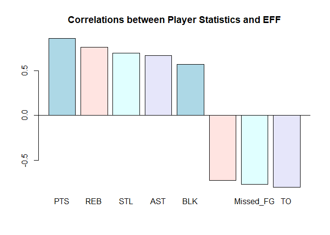
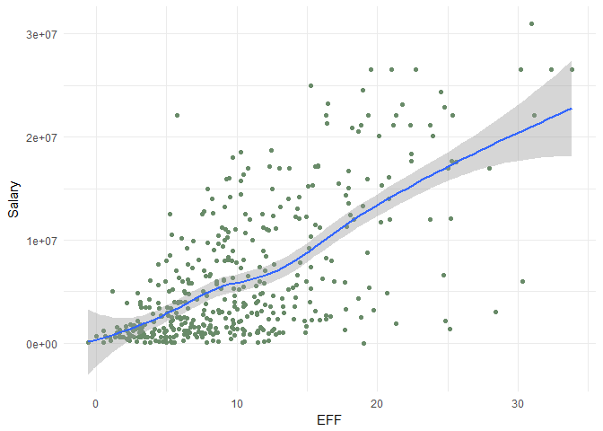
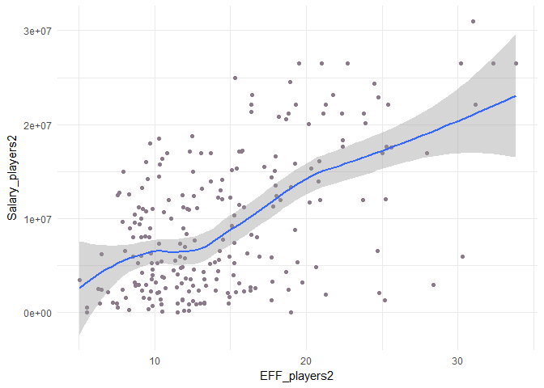

hw02-lindsay-dahlen.Rmd
================
Lindsay Dahlen
September 28, 2017

Part 2
======

``` r
# Base
github <- "http://github.com/ucb-stat133/stat133-fall-2017/raw/master/"
file <- "data/nba2017-player-statistics.csv"
csv <- paste0(github, file)
download.file(url = csv, destfile = "nba2017-player-statistics.csv")
library(readr)

base_csv <- read.csv(csv, colClasses = c("Player" = "character", "Team" = "character", "Experience" = "character", "Position" = "factor", "Salary" = "double"))
str(base_csv)
```

    ## 'data.frame':    441 obs. of  24 variables:
    ##  $ Player      : chr  "Al Horford" "Amir Johnson" "Avery Bradley" "Demetrius Jackson" ...
    ##  $ Team        : chr  "BOS" "BOS" "BOS" "BOS" ...
    ##  $ Position    : Factor w/ 5 levels "C","PF","PG",..: 1 2 5 3 4 3 4 5 4 2 ...
    ##  $ Experience  : chr  "9" "11" "6" "R" ...
    ##  $ Salary      : num  26540100 12000000 8269663 1450000 1410598 ...
    ##  $ Rank        : int  4 6 5 15 11 1 3 13 8 10 ...
    ##  $ Age         : int  30 29 26 22 31 27 26 21 20 29 ...
    ##  $ GP          : int  68 80 55 5 47 76 72 29 78 78 ...
    ##  $ GS          : int  68 77 55 0 0 76 72 0 20 6 ...
    ##  $ MIN         : int  2193 1608 1835 17 538 2569 2335 220 1341 1232 ...
    ##  $ FGM         : int  379 213 359 3 95 682 333 25 192 114 ...
    ##  $ FGA         : int  801 370 775 4 232 1473 720 58 423 262 ...
    ##  $ Points3     : int  86 27 108 1 39 245 157 12 46 45 ...
    ##  $ Points3_atts: int  242 66 277 1 111 646 394 35 135 130 ...
    ##  $ Points2     : int  293 186 251 2 56 437 176 13 146 69 ...
    ##  $ Points2_atts: int  559 304 498 3 121 827 326 23 288 132 ...
    ##  $ FTM         : int  108 67 68 3 33 590 176 6 85 26 ...
    ##  $ FTA         : int  135 100 93 6 41 649 217 9 124 37 ...
    ##  $ OREB        : int  95 117 65 2 17 43 48 6 45 60 ...
    ##  $ DREB        : int  369 248 269 2 68 162 367 20 175 213 ...
    ##  $ AST         : int  337 140 121 3 33 449 155 4 64 71 ...
    ##  $ STL         : int  52 52 68 0 9 70 72 10 35 26 ...
    ##  $ BLK         : int  87 62 11 0 7 13 23 2 18 17 ...
    ##  $ TO          : int  116 77 88 0 25 210 79 4 68 39 ...

``` r
# readr

readr_csv <- read_csv(csv, col_types = cols( Player = col_character(),  Team = col_character(), Experience = col_character(), Position = col_factor(c("C", "PF", "PG", "SF", "SG")), Salary = col_double()))
```

    ## `curl` package not installed, falling back to using `url()`

``` r
str(readr_csv)
```

    ## Classes 'tbl_df', 'tbl' and 'data.frame':    441 obs. of  24 variables:
    ##  $ Player      : chr  "Al Horford" "Amir Johnson" "Avery Bradley" "Demetrius Jackson" ...
    ##  $ Team        : chr  "BOS" "BOS" "BOS" "BOS" ...
    ##  $ Position    : Factor w/ 5 levels "C","PF","PG",..: 1 2 5 3 4 3 4 5 4 2 ...
    ##  $ Experience  : chr  "9" "11" "6" "R" ...
    ##  $ Salary      : num  26540100 12000000 8269663 1450000 1410598 ...
    ##  $ Rank        : int  4 6 5 15 11 1 3 13 8 10 ...
    ##  $ Age         : int  30 29 26 22 31 27 26 21 20 29 ...
    ##  $ GP          : int  68 80 55 5 47 76 72 29 78 78 ...
    ##  $ GS          : int  68 77 55 0 0 76 72 0 20 6 ...
    ##  $ MIN         : int  2193 1608 1835 17 538 2569 2335 220 1341 1232 ...
    ##  $ FGM         : int  379 213 359 3 95 682 333 25 192 114 ...
    ##  $ FGA         : int  801 370 775 4 232 1473 720 58 423 262 ...
    ##  $ Points3     : int  86 27 108 1 39 245 157 12 46 45 ...
    ##  $ Points3_atts: int  242 66 277 1 111 646 394 35 135 130 ...
    ##  $ Points2     : int  293 186 251 2 56 437 176 13 146 69 ...
    ##  $ Points2_atts: int  559 304 498 3 121 827 326 23 288 132 ...
    ##  $ FTM         : int  108 67 68 3 33 590 176 6 85 26 ...
    ##  $ FTA         : int  135 100 93 6 41 649 217 9 124 37 ...
    ##  $ OREB        : int  95 117 65 2 17 43 48 6 45 60 ...
    ##  $ DREB        : int  369 248 269 2 68 162 367 20 175 213 ...
    ##  $ AST         : int  337 140 121 3 33 449 155 4 64 71 ...
    ##  $ STL         : int  52 52 68 0 9 70 72 10 35 26 ...
    ##  $ BLK         : int  87 62 11 0 7 13 23 2 18 17 ...
    ##  $ TO          : int  116 77 88 0 25 210 79 4 68 39 ...
    ##  - attr(*, "spec")=List of 2
    ##   ..$ cols   :List of 24
    ##   .. ..$ Player      : list()
    ##   .. .. ..- attr(*, "class")= chr  "collector_character" "collector"
    ##   .. ..$ Team        : list()
    ##   .. .. ..- attr(*, "class")= chr  "collector_character" "collector"
    ##   .. ..$ Position    :List of 3
    ##   .. .. ..$ levels    : chr  "C" "PF" "PG" "SF" ...
    ##   .. .. ..$ ordered   : logi FALSE
    ##   .. .. ..$ include_na: logi FALSE
    ##   .. .. ..- attr(*, "class")= chr  "collector_factor" "collector"
    ##   .. ..$ Experience  : list()
    ##   .. .. ..- attr(*, "class")= chr  "collector_character" "collector"
    ##   .. ..$ Salary      : list()
    ##   .. .. ..- attr(*, "class")= chr  "collector_double" "collector"
    ##   .. ..$ Rank        : list()
    ##   .. .. ..- attr(*, "class")= chr  "collector_integer" "collector"
    ##   .. ..$ Age         : list()
    ##   .. .. ..- attr(*, "class")= chr  "collector_integer" "collector"
    ##   .. ..$ GP          : list()
    ##   .. .. ..- attr(*, "class")= chr  "collector_integer" "collector"
    ##   .. ..$ GS          : list()
    ##   .. .. ..- attr(*, "class")= chr  "collector_integer" "collector"
    ##   .. ..$ MIN         : list()
    ##   .. .. ..- attr(*, "class")= chr  "collector_integer" "collector"
    ##   .. ..$ FGM         : list()
    ##   .. .. ..- attr(*, "class")= chr  "collector_integer" "collector"
    ##   .. ..$ FGA         : list()
    ##   .. .. ..- attr(*, "class")= chr  "collector_integer" "collector"
    ##   .. ..$ Points3     : list()
    ##   .. .. ..- attr(*, "class")= chr  "collector_integer" "collector"
    ##   .. ..$ Points3_atts: list()
    ##   .. .. ..- attr(*, "class")= chr  "collector_integer" "collector"
    ##   .. ..$ Points2     : list()
    ##   .. .. ..- attr(*, "class")= chr  "collector_integer" "collector"
    ##   .. ..$ Points2_atts: list()
    ##   .. .. ..- attr(*, "class")= chr  "collector_integer" "collector"
    ##   .. ..$ FTM         : list()
    ##   .. .. ..- attr(*, "class")= chr  "collector_integer" "collector"
    ##   .. ..$ FTA         : list()
    ##   .. .. ..- attr(*, "class")= chr  "collector_integer" "collector"
    ##   .. ..$ OREB        : list()
    ##   .. .. ..- attr(*, "class")= chr  "collector_integer" "collector"
    ##   .. ..$ DREB        : list()
    ##   .. .. ..- attr(*, "class")= chr  "collector_integer" "collector"
    ##   .. ..$ AST         : list()
    ##   .. .. ..- attr(*, "class")= chr  "collector_integer" "collector"
    ##   .. ..$ STL         : list()
    ##   .. .. ..- attr(*, "class")= chr  "collector_integer" "collector"
    ##   .. ..$ BLK         : list()
    ##   .. .. ..- attr(*, "class")= chr  "collector_integer" "collector"
    ##   .. ..$ TO          : list()
    ##   .. .. ..- attr(*, "class")= chr  "collector_integer" "collector"
    ##   ..$ default: list()
    ##   .. ..- attr(*, "class")= chr  "collector_guess" "collector"
    ##   ..- attr(*, "class")= chr "col_spec"

3) Right after imiporting the data
==================================

``` r
Experience <- base_csv[ , 4]
Experience_integer <- replace(Experience, Experience == "R", 0)
Experience_int <- as.integer(Experience_integer)

# Help - how to make Experience_int into base_csv and readr_csv?
```

4) Performance of players
=========================

``` r
# Variables of EFF
library(dplyr)
```

    ## Warning: package 'dplyr' was built under R version 3.4.2

    ## 
    ## Attaching package: 'dplyr'

    ## The following objects are masked from 'package:stats':
    ## 
    ##     filter, lag

    ## The following objects are masked from 'package:base':
    ## 
    ##     intersect, setdiff, setequal, union

``` r
FGA <- base_csv[ , 12]
FGM <- base_csv[ , 11]
missed_fg <- FGA-FGM
base_csv3 <- mutate(base_csv, Missed_FG = FGA - FGM)


FTA <- base_csv[ ,18]
FTM <- base_csv[ , 17]
missed_ft <- FTA-FTM
base_csv3 <- mutate(base_csv3, Missed_FT = FTA - FTM)

Points3 <- base_csv[ , 13]
Points2 <- base_csv[ , 15]
base_csv3 <- mutate(base_csv3, PtS = (3*Points3)+(2*Points2)+FTM)

OREB <- base_csv[ , 19]
DREB <- base_csv[ , 20]
base_csv3 <- mutate(base_csv3, REB = OREB+DREB)

MIN <- base_csv[ , 10]
GP <- base_csv[ , 8]
base_csv3 <- mutate(base_csv3, MPG = MIN/GP)

str(base_csv3)
```

    ## 'data.frame':    441 obs. of  29 variables:
    ##  $ Player      : chr  "Al Horford" "Amir Johnson" "Avery Bradley" "Demetrius Jackson" ...
    ##  $ Team        : chr  "BOS" "BOS" "BOS" "BOS" ...
    ##  $ Position    : Factor w/ 5 levels "C","PF","PG",..: 1 2 5 3 4 3 4 5 4 2 ...
    ##  $ Experience  : chr  "9" "11" "6" "R" ...
    ##  $ Salary      : num  26540100 12000000 8269663 1450000 1410598 ...
    ##  $ Rank        : int  4 6 5 15 11 1 3 13 8 10 ...
    ##  $ Age         : int  30 29 26 22 31 27 26 21 20 29 ...
    ##  $ GP          : int  68 80 55 5 47 76 72 29 78 78 ...
    ##  $ GS          : int  68 77 55 0 0 76 72 0 20 6 ...
    ##  $ MIN         : int  2193 1608 1835 17 538 2569 2335 220 1341 1232 ...
    ##  $ FGM         : int  379 213 359 3 95 682 333 25 192 114 ...
    ##  $ FGA         : int  801 370 775 4 232 1473 720 58 423 262 ...
    ##  $ Points3     : int  86 27 108 1 39 245 157 12 46 45 ...
    ##  $ Points3_atts: int  242 66 277 1 111 646 394 35 135 130 ...
    ##  $ Points2     : int  293 186 251 2 56 437 176 13 146 69 ...
    ##  $ Points2_atts: int  559 304 498 3 121 827 326 23 288 132 ...
    ##  $ FTM         : int  108 67 68 3 33 590 176 6 85 26 ...
    ##  $ FTA         : int  135 100 93 6 41 649 217 9 124 37 ...
    ##  $ OREB        : int  95 117 65 2 17 43 48 6 45 60 ...
    ##  $ DREB        : int  369 248 269 2 68 162 367 20 175 213 ...
    ##  $ AST         : int  337 140 121 3 33 449 155 4 64 71 ...
    ##  $ STL         : int  52 52 68 0 9 70 72 10 35 26 ...
    ##  $ BLK         : int  87 62 11 0 7 13 23 2 18 17 ...
    ##  $ TO          : int  116 77 88 0 25 210 79 4 68 39 ...
    ##  $ Missed_FG   : int  422 157 416 1 137 791 387 33 231 148 ...
    ##  $ Missed_FT   : int  27 33 25 3 8 59 41 3 39 11 ...
    ##  $ PtS         : num  952 520 894 10 262 ...
    ##  $ REB         : int  464 365 334 4 85 205 415 26 220 273 ...
    ##  $ MPG         : num  32.2 20.1 33.4 3.4 11.4 ...

``` r
# Naming Ojbects in base_csv3
Missed_FG <- base_csv3[ , 25]
Missed_FT <- base_csv3[ , 26]
PTS <- base_csv3[ , 27]
REB <- base_csv3[ , 28]
MPG <- base_csv3[ , 29]

# Calculating EFF
base_csv3 <- mutate(base_csv3, (PTS + REB + AST + STL + BLK - Missed_FG - Missed_FT - TO)/GP)
EFF <- base_csv3[ , 30]
summary(EFF)
```

    ##    Min. 1st Qu.  Median    Mean 3rd Qu.    Max. 
    ##  -0.600   5.452   9.090  10.137  13.247  33.840

``` r
# Histogram
hist(EFF)
```



``` r
# Names of players that have a negative EFF

negative_EFF <- filter(base_csv3, EFF < 0)
negative_EFF[ , 1]
```

    ## [1] "Patricio Garino"

``` r
# Use the function cor() to compute the correlation coefficients between EFF and all the variables used in the EFF formula.
PTS_cor <- cor(PTS, EFF)
PTS_cor
```

    ## [1] 0.8588644

``` r
REB_cor <- cor(REB, EFF)
REB_cor
```

    ## [1] 0.7634501

``` r
STL <- base_csv3[ , 22]
STL_cor <- cor(STL, EFF)
STL_cor
```

    ## [1] 0.6957286

``` r
AST <- base_csv3[ , 21]
AST_cor <- cor(AST, EFF)
AST_cor
```

    ## [1] 0.6689232

``` r
BLK <- base_csv3[ , 23]
BLK_cor <- cor(BLK, EFF)
BLK_cor
```

    ## [1] 0.5679571

``` r
MissedFG_cor <- cor(Missed_FG, EFF)
MissedFG_cor <- 0-MissedFG_cor
MissedFG_cor
```

    ## [1] -0.7722477

``` r
MissedFT_cor <- cor(Missed_FT, EFF)
MissedFT_cor <- 0 - MissedFT_cor
MissedFT_cor
```

    ## [1] -0.7271456

``` r
TO <- base_csv3[ , 24]
TO_cor <- cor(TO, EFF)
TO_cor <- 0 - TO_cor
TO_cor
```

    ## [1] -0.8003289

``` r
EFF_cor <- data.frame(PTS_cor, REB_cor, STL_cor, AST_cor, BLK_cor, MissedFG_cor,
                      MissedFT_cor, TO_cor)
EFF_correlation <- c(PTS_cor, REB_cor, STL_cor, AST_cor, BLK_cor, MissedFG_cor, 
                     MissedFT_cor, TO_cor)
```

``` r
#Display the computed correlations in descending order
EFF_desc_cor <- c(PTS_cor, REB_cor, STL_cor, AST_cor, BLK_cor, MissedFT_cor, MissedFG_cor, TO_cor)
EFF_desc_cor
```

    ## [1]  0.8588644  0.7634501  0.6957286  0.6689232  0.5679571 -0.7271456
    ## [7] -0.7722477 -0.8003289

``` r
# Barplot
barplot(EFF_desc_cor, width = 1, space = NULL, main = "Correlations between Player Statistics and EFF", border = TRUE, axisnames = TRUE, col = c("lightblue", "mistyrose", "lightcyan", "lavender"), names.arg = c("PTS", "REB", "STL", "AST", "BLK", "Missed_FT", "Missed_FG", "TO")) 
abline(a = 0, b = 0)
```



5) Efficiency and Salary
========================

``` r
library(ggplot2)
ggplot(data = base_csv3, aes(x = EFF, y = Salary)) + geom_point(col = "darkseagreen4") + theme_minimal() + geom_smooth(method = loess)
```



-   I would say that EFF is not related to Salary.

``` r
# "Solid" Player Universe
little_bench_time <- filter(base_csv3, MPG >= 20)
players2 <- data.frame(little_bench_time)
EFF_players2 <- players2[ , 30]
Salary_players2 <- players2[ , 5]
ggplot(data = players2, aes(x = EFF_players2, y = Salary_players2)) + geom_point(col = "thistle4") + theme_minimal() + geom_smooth(method = loess)
```



``` r
cor(EFF_players2, Salary_players2)
```

    ## [1] 0.5367224

-   Among the more extablished players, EFF and Salary are not especially correlated, as their linear correlation value is around 0.53. The loess line also seems to have a wide range.

6) Comments and Reflections
===========================

-   "What things were hard, even though you saw them in class/lab?"

Figuring out Github is still confusing for me. Understanding how columns and data frames work is also not fully solid.

-   "What was easy even though we haven't done it in class/lab?"

I don't think there was much here that we hadn't done in class or lab. The things I was most comfortable with were the things that I have seen already in class or lab.

-   "Did you need help to complete this assignment? If so, what kind of help?"

The only help I used was previous lab instructions, Piazza, R Help, and various tutorials that I looked up on the internet.

-   "What was the most time consuming part?"

The most time consuming part was calculating the EFF, expecially using the mutate function for each and every single variable. I tried to combine them at first, but I was unsuccesful.

-   "Was there anything that you did not understand? or fully grasped?"

I'm still a little confused on how to use mutate() to create new data frames. I'm also unsure what the difference between readr and the base functions are. It doesn't seem like there are many advantages.

-   "Was there anything frustrating in particular?"

I found that trying to manipulate the variables in the data frame was the most frustrating. I feel that it is very time consuming, and I always forget how to do it. Everytime I akea break, it seems like I have to relearn how to manipulate data frames.

-   "Was there anything exciting? Something that you feel proud of?"

I'm super tired, so I'm not exceptionally proud of anything but I'm glad that I finally finished the homework and put my best effort into completing everything.
